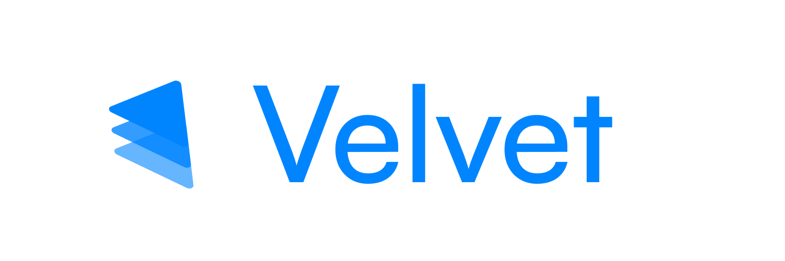

Velvet is a robust, efficient, and flexible framework for developing Flutter applications.
It is designed to be simple to use and easy to understand, while providing a solid foundation for building production-ready applications.

> [!WARNING] 
> This project is still in the early stages of development and is not yet ready for production use.

## Learning Velvet

- **[Documentation](https://velvet.dedecube.dev)**: The best place to start learning about Velvet is the official documentation.
- **[Discord](https://discord.gg/hU3nzdsf95)**: Join the Velvet Discord server to ask questions and get help from the community.

We are actively working on improving the documentation and adding more examples to help you get started with Velvet.

## Packages

Velvet is composed of several packages, each of which provides a specific set of features.

| Package                                             | Version                                                                                                              | Description                                                                              |
| --------------------------------------------------- | -------------------------------------------------------------------------------------------------------------------- | ---------------------------------------------------------------------------------------- |
| [velvet_framework](packages/velvet_framework)       |        | The core package that provides the foundation for building Flutter applications.         |
| [velvet_annotation](packages/velvet_annotation)     |      | A set of annotations that can be used to generate code for Velvet applications.          |
| [velvet_cli](packages/velvet_cli)                   |                    | A command-line interface that can be used to generate code for Velvet applications.      |
| [velvet_custom_lints](packages/velvet_custom_lints) |  | A set of custom lints that can be used to enforce best practices in Velvet applications. |
| [velvet_generator](packages/velvet_generator)       |        | A code generator that generates code for Velvet applications.                            |
| [velvet_lints](packages/velvet_lints)               |                | A set of lints that can be used to enforce best practices in Velvet applications.        |
| [velvet_support](packages/velvet_support)           |            | A set of utilities and helpers that can be used to build Velvet applications.            |

## Contributing

If you would like to contribute to Velvet, please read the [contributing guidelines](CONTRIBUTING.md) before submitting a pull request.

## License

Velvet is released under the [MIT License](LICENSE).

